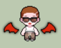

# ON:SON

따뜻한 마음을 함께 나누고, 세상을 밝히는 힘이 되어 주세요!


<br>

# 프로젝트 소개

가까운 거리에 도움이 필요한 분들을 손쉽게 찾고, 봉사 활동에 참여하며 따뜻한 세상을 함께 만들어갈 수 있습니다.

<br>

## 🕹️ 프로젝트 기능

### 1. **페이지 구성**

- **홈페이지 (`/`)** : 마감 기한 임박 봉사 리스트, 온손이 플로팅 버튼을 통한 챗봇 ai와 채팅 모달창, 지역 검색 기능
- **봉사게시판 (`/list`)** : 봉사 전체 리스트, 키워드 & 카테고리 검색 기능
- **게시글 디테일 (`/detail/[id]`)** : 북마크, 내 게시글 모집 마감, 수정, 삭제 기능, 내 봉사에 참여한 봉사자 리스트
- **봉사요청 (`/create`)** : 봉사를 요청하고자 하는 유저가 게시글을 작성하는 페이지
- **게시글 수정 (`/post-update/[id]`)** : 해당 유저가 작성한 게시글을 수정하는 페이지
- **마이 페이지 (`/my-page`)** : 나의 정보 제공 및 프로필 수정
- **유저 페이지 (`/user-page`)** : 해당 유저에 대한 정보 제공
- **로그인 (`/login` / modal)** : 이메일 로그인, 카카오 소셜 로그인
- **회원가입 (`/sign-up`)** : 중복 이메일, 중복 닉네임 필터링
- **온손 ai 챗봇 (modal)** : 웹 사이트에 대한 전반적인 소개 및 질문을 받는 ai 챗봇
- **채팅하기 (modal)** : 채팅을 통해 봉사 신청 

### 2. **상세 기능**

#### 회원가입 및 로그인

- 사용자 회원가입 (이메일/비밀번호)
- 중복 이메일과 중복 닉네임 필터링
- Kakao 소셜 로그인
- 비밀번호 실시간 유효성 검사


#### 홈페이지

- Swiper 기반의 배너 슬라이드 기능
- 지역 검색을 통해 1차적으로 게시글 필터링
- 마감 기한 임박한 게시글 리스트
- Tanstack Query를 활용한 데이터 페칭
  

#### 봉사게시판

- 전체 게시글 리스트 
- 카테고리와 키워드 검색 기능
- 모집 중인 게시글 필터링
- useInfiniteQuery 훅을 사용하여 무한스크롤 구현


#### 게시글 디테일 페이지

- 봉사활동 상세 정보 확인 기능
- 상세 게시글에 대한 CRUD 기능
- 내 봉사에 참여한 봉사자 체크 리스트
- 북마크 기능
- 디테일 페이지에서 글 작성한 유저에게 바로 채팅으로 봉사 신청하기 


#### ai 챗봇
- 사용자가 웹사이트에 관해 궁금한 점을 'AI 챗봇'과 대화를 통해 해결 가능
- AI 모델을 기반으로 봉사 활동 관련 정보 추천
- 프로젝트에서 OpenAI API 활용
- 온손이의 마스코트와 연계하여 자연스러운 UX 제공

#### 채팅하기
- 실시간으로 게시글 작성자와 봉사 관련 채팅
- 채팅 모달에서 즉시 대화 가능
- 봉사 신청자의 요청 및 진행 상황 관리

<br>

## 👨‍👩‍👧‍👦 팀 소개

- ON:SON = ON(켜다) + SON(손) 
- 프론트엔드 개발자 (5명)
- 디자이너 (1명)

| 팀장 : 한다영 | 부팀장 : 김진실 | 팀원 : 김문식 | 팀원 : 이경민   | 팀원 : 이지원| 디자이너 : 서한솔 |
| ------------- | --------------- | ------------- | -------------- | ------------ | ---------------- |
|  |  |  |  |  | 6 | 
| [@한다영](https://github.com/gksek015) |  [@김진실](https://github.com/jinsil-kim)  |  [@김문식](https://github.com/kimmunsik20240905)  |  [@이경민](https://github.com/zzxx66052)  |  [@이지원](https://github.com/dongeul24)  |  |

## 🌱 역할 분담

| 이름 | 역할 |
| ---- | ---- | 
| 한다영 | 게시글 작성, 게시글 수정 |
| 김진실 | 메인페이지, 봉사게시판 페이지 | 
| 김문식 | 로그인, 회원가입, 마이페이지, 유저 페이지 |
| 이경민 | 채팅 기능, 봉사 참여자 리스트 |
| 이지원 | 챗봇 ai, 게시글 디테일 |
| 서한솔 | 모바일 디자인 및 웹 디자인 |

<br>

## 🛠️ 아키텍처


### 설명
- 사용자는 클라이언트를 통해 Supabase DB에 저장된 데이터를 조회하거나 업데이트할 수 있음.
- Supabase 인증 모듈을 통해 사용자 인증 및 세션 관리.
- React Query를 활용해 캐싱된 상태 기반 데이터 요청 처리 및 무한 스크롤 구현.

<br>

## 💼 ERD


### 주요 테이블 및 관계 설명
- `users` : 회원 정보를 저장하는 테이블. 봉사 요청 글 및 봉사자 활동과 연계됩니다.  
- `posts` : 봉사 요청 및 지원 정보를 저장하는 테이블
- `chats` : 채팅을 주고 받은 유저 정보를 저장하는 테이블  
- `bookmarks` : 사용자가 북마크한 게시글 기록. 다대다 관계 용도로 활용
- `messages` : 작성자과 신청자 간의 채팅 대회 내용을 관리하는 테이블
- `participant` : 참여자 리스트 정보를 저장하기 위한 테이블
- `images` : 스토리지에 저장된 이미지 url을 관리하는 테이블

<br>

## ⚙️ 기술 스택

### **프레임워크 및 라이브러리 코어**

  


### **상태 관리 및 데이터 베이스**

- Tanstack Query
- Zustand
- Supabase

### **폼, 유효성 검사**

- React Hook Form
- Zod

### **UI/UX**

- Tailwind css
- Swiper
- SweetAlert2
- react-toastify
- clsx
- react-spring-bottom-sheet-updated
- react-calendar
- react-intersection-observer
- slick-carousel


### **유틸리티 및 기타 개발 도구**

- ai-sdk/openai
- dayjs
- eslint
- prettier

### **기타 도구 및 설정**

- ESLint 및 Prettier로 코드 스타일 관리
- vercel로 배포

<br>

## 🌳 프로젝트 구조

```
📁 ONSON/
├── 📁 .github/                 # GitHub 관련 설정 및 템플릿
│   ├── 📄 PULL_REQUEST_TEMPLATE.md  # PR 템플릿
├── 📁 .next/                   # Next.js 빌드 출력물 (자동 생성)
├── 📁 .vscode/                 # VSCode 설정 파일
├── 📁 node_modules/            # 프로젝트 의존성 모듈
├── 📁 images/                  # Readme용 이미지
├── 📁 src/                     # 소스 코드 디렉토리
│   ├── 📁 app/                 # Next.js App Router 구조
│   │   ├── 📁 (auth)/          # 인증 관련 및 마이 페이지
│   │   ├── 📁 (home)/          # 홈 관련 페이지
│   │   ├── 📁 api/             # API 라우트
│   │   ├── 📁 create/          # 생성 관련 페이지
│   │   ├── 📁 detail/          # 상세 조회 페이지
│   │   ├── 📁 font/            # 웹 폰트 관련 파일
│   │   ├── 📁 list/            # 리스트 페이지
│   │   ├── 📁 post-update/     # 게시물 업데이트 페이지
│   │   ├── 📄 error.tsx        # 에러 페이지 컴포넌트
│   │   ├── 🖼️ favicon.ico      # 파비콘
│   │   ├── 🎨 globals.css      # 전역 스타일
│   │   ├── 📄 layout.tsx       # 레이아웃 컴포넌트
│   │   ├── 📄 page.tsx         # 메인 페이지
│   │   ├── 📄 QueryProvider.tsx # React Query Provider 설정
│   ├── 📁 assets/              # 정적 리소스 (이미지)
│   ├── 📁 components/          # 재사용 가능한 UI 컴포넌트
│   ├── 📁 constants/           # 프로젝트 전역에서 사용할 상수 데이터 모음
│   ├── 📁 hooks/               # 커스텀 React 훅
│   ├── 📁 lib/                 # 외부 라이브러리 설정 및 유틸 함수
│   ├── 📁 types/               # TypeScript 타입 정의 파일
│   ├── 📁 utils/               # 헬퍼 함수 모음
│   ├── 📄 middleware.ts        # API 미들웨어 설정
├── 📁 supabase/                # Supabase 관련 설정 및 초기화 코드
├── 📄 .env.local               # 환경 변수 파일 (로컬 전용)
├── 📄 .eslintrc.json           # ESLint 설정 파일
├── 📄 .gitignore               # Git 무시할 파일 목록
├── 📄 .prettierrc              # Prettier 코드 스타일 설정
├── 📄 next-env.d.ts            # Next.js 환경 타입 정의
├── 📄 next.config.mjs          # Next.js 설정 파일
├── 📄 package.json             # 프로젝트 의존성 및 스크립트
├── 📄 postcss.config.mjs       # PostCSS 설정 파일
├── 📄 README.md                # 프로젝트 설명 문서
├── 📄 tailwind.config.ts       # Tailwind CSS 설정 파일
├── 📄 tsconfig.json            # TypeScript 설정 파일
└── 📄 yarn.lock                # Yarn 패키지 버전 관리 파일
```

