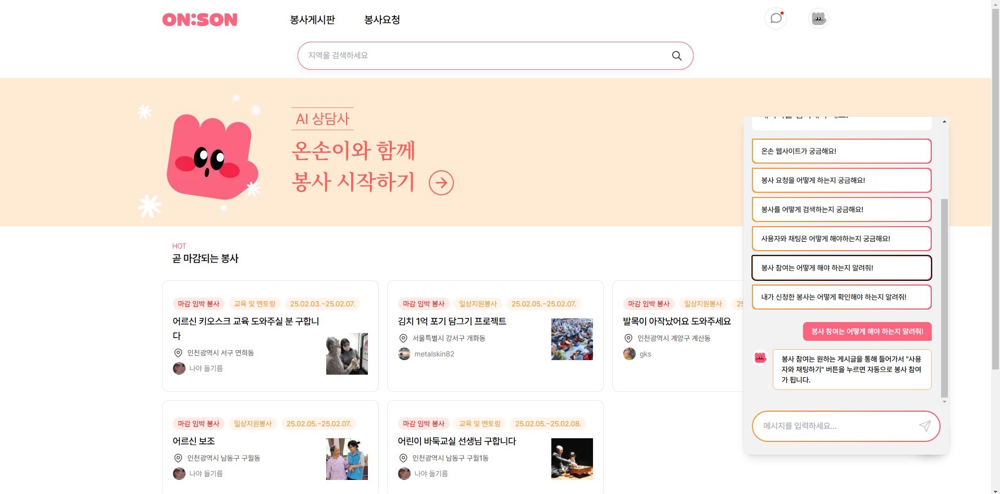

# ON:SON

따뜻한 마음을 함께 나누고, 세상을 밝히는 힘이 되어 주세요!


<br>

# 프로젝트 소개

가까운 거리에 도움이 필요한 분들을 손쉽게 찾고, 봉사 활동에 참여하며 따뜻한 세상을 함께 만들어갈 수 있습니다.

<br>

# 🕹️ 프로젝트 기능

### 1. **페이지 구성**

- **홈페이지 (`/`)** : 마감 기한 임박 봉사 리스트, 온손이 플로팅 버튼을 통한 챗봇 ai와 채팅 모달창, 지역 검색 기능
  <br>
- **봉사게시판 (`/list`)** : 봉사 전체 리스트, 키워드 & 카테고리 검색 기능
  <br>
- **게시글 디테일 (`/detail/[id]`)** : 북마크, 내 게시글 모집 마감, 수정, 삭제 기능, 내 봉사에 참여한 봉사자 리스트
  <br>
- **봉사요청 (`/create`)** : 봉사를 요청하고자 하는 유저가 게시글을 작성하는 페이지
  <br>
- **게시글 수정 (`/post-update/[id]`)** : 해당 유저가 작성한 게시글을 수정하는 페이지
   <br>
- **마이 페이지 (`/my-page`)** : 나의 정보 제공 및 프로필 수정
  <br>
- **유저 페이지 (`/user-page`)** : 해당 유저에 대한 정보 제공
  <br>
- **로그인 (`/login` / modal)** : 이메일 로그인, 카카오 소셜 로그인
  <br>
- **회원가입 (`/sign-up`)** : 중복 이메일, 중복 닉네임 필터링
   <br>
- **온손 ai 챗봇 (modal)** : 웹 사이트에 대한 전반적인 소개 및 질문을 받는 ai 챗봇
  <br>
- **채팅하기 (modal)** : 채팅을 통해 봉사 신청

<br>

### 2. **상세 기능**

<details><summary>**회원가입 / 로그인**

</summary>

- 사용자 회원가입 (이메일/비밀번호)
- 중복 이메일과 중복 닉네임 필터링
- Kakao 소셜 로그인
- 비밀번호 실시간 유효성 검사

    <br>

  
  </details>

<br>

<details><summary>**홈페이지**

</summary>

- Swiper 기반의 배너 슬라이드 기능
- 지역 검색을 통해 1차적으로 게시글 필터링
- 마감 기한 임박한 게시글 리스트
- Tanstack Query를 활용한 데이터 페칭

    <br>


</details>

<br>

<details><summary>**봉사게시판**

</summary>

- 전체 게시글 리스트
- 카테고리와 키워드 검색 기능
- 모집 중인 게시글 필터링
- useInfiniteQuery 훅을 사용하여 무한스크롤 구현

    <br>

  
  </details>

<br>

<details><summary>**게시글 디테일 페이지**

</summary>

- 봉사활동 상세 정보 확인 기능
- 상세 게시글에 대한 CRUD 기능
- 내 봉사에 참여한 봉사자 체크 리스트
- 북마크 기능
- 디테일 페이지에서 글 작성한 유저에게 바로 채팅으로 봉사 신청하기

    <br>

  
  </details>

<br>

<details><summary>**ai 챗봇**

</summary>

- 사용자가 웹사이트에 관해 궁금한 점을 'AI 챗봇'과 대화를 통해 해결 가능
- AI 모델을 기반으로 봉사 활동 관련 정보 추천
- 프로젝트에서 OpenAI API 활용
- 온손이의 마스코트와 연계하여 자연스러운 UX 제공

  <br>



</details>

<br>

<details><summary>**채팅하기**

</summary>

- 실시간으로 게시글 작성자와 봉사 관련 채팅
- 채팅 모달에서 즉시 대화 가능
- 봉사 신청자의 요청 및 진행 상황 관리

  <br>


</details>

<br>

<details><summary>**마이페이지 / 유저페이지**

</summary>

- 내 프로필 수정
- 내가 참여한 봉사, 내가 쓴 게시글, 내가 북마크 한 게시글 확인
- 상대방의 프로필 확인
- 클릭한 유저가 올린 게시글과 참여할 게시글 확인 가능

    <br>

  

  <br>

</details>

  <br>

# 👨‍👩‍👧‍👦 팀 소개

- ON:SON = ON(켜다) + SON(손)
- 프론트엔드 개발자 (5명)
- 디자이너 (1명)

  <br>

| 팀장 : 한다영                          | 부팀장 : 김진실                          | 팀원 : 김문식                                   | 팀원 : 이경민                           | 팀원 : 이지원                           | 디자이너 : 서한솔 |
| -------------------------------------- | ---------------------------------------- | ----------------------------------------------- | --------------------------------------- | --------------------------------------- | ----------------- |
|         |           |                  |          |          | 
                 |
| [@한다영](https://github.com/gksek015) | [@김진실](https://github.com/jinsil-kim) | [@김문식](https://github.com/kimmunsik20240905) | [@이경민](https://github.com/zzxx66052) | [@이지원](https://github.com/dongeul24) |                   |

  <br>

## 🌱 역할 분담

| 이름   | 역할                                      |
| ------ | ----------------------------------------- |
| 한다영 | 게시글 작성, 게시글 수정                  |
| 김진실 | 메인페이지, 봉사게시판 페이지             |
| 김문식 | 로그인, 회원가입, 마이페이지, 유저 페이지 |
| 이경민 | 채팅 기능, 봉사 참여자 리스트             |
| 이지원 | 챗봇 ai, 게시글 디테일                    |
| 서한솔 | 모바일 디자인 및 웹 디자인                |

<br>

# 🛠️ 아키텍처


<details><summary>**설명**

</summary>

- 사용자는 클라이언트를 통해 Supabase DB에 저장된 데이터를 조회하거나 업데이트할 수 있음.
- Supabase 인증 모듈을 통해 사용자 인증 및 세션 관리.
- React Query를 활용해 캐싱된 상태 기반 데이터 요청 처리 및 무한 스크롤 구현.
- Open Ai API를 사용해 ai 챗봇 기능 구현
- Vercel을 통한 웹사이트 배포

    <br>

  </details>

<br>

# 💼 ERD


<details><summary>**주요 테이블 및 관계 설명**

</summary>

- `users` : 회원 정보를 저장하는 테이블. 봉사 요청 글 및 봉사자 활동과 연계됩니다.
- `posts` : 봉사 요청 및 지원 정보를 저장하는 테이블
- `chats` : 채팅을 주고 받은 유저 정보를 저장하는 테이블
- `bookmarks` : 사용자가 북마크한 게시글 기록. 다대다 관계 용도로 활용
- `messages` : 작성자과 신청자 간의 채팅 대회 내용을 관리하는 테이블
- `participant` : 참여자 리스트 정보를 저장하기 위한 테이블
- `images` : 스토리지에 저장된 이미지 url을 관리하는 테이블

    <br>

  </details>

<br>

# ⚙️ 기술 스택

### **프레임워크 및 라이브러리 코어**

- Next.js
- React
- Typescript
- Visual Studio Code

### **상태 관리 및 데이터 베이스**

- Tanstack Query
- Zustand
- Supabase

### **폼, 유효성 검사**

- React Hook Form
- Zod

### **UI/UX**

- Tailwind css
- Swiper
- SweetAlert2
- react-toastify
- clsx
- react-spring-bottom-sheet-updated
- react-calendar
- react-intersection-observer
- slick-carousel

### **유틸리티 및 기타 개발 도구**

- ai-sdk/openai
- dayjs
- eslint
- prettier


<br>

# 🌳 프로젝트 구조

```
📦 ONSON/
├── 📂 .github
├── 📂 .next
├── 📂 .vscode
├── 📂 images
├── 📂 node_modules
├── 📂 src
│   ├── 📂 app
│   │   ├── 📂 (auth)
│   │   │   ├── 📂 _components
│   │   │   ├── 📂 login
│   │   │   ├── 📂 my-page
│   │   │   ├── 📂 reset-password
│   │   │   ├── 📂 sign-up
│   │   │   ├── 📂 user-page
│   │   │   ├── 📝 error.tsx
│   │   │   ├── 📝 layout.tsx
│   │   ├── 📂 (home)
│   │   │   ├── 📝 AddressButton.tsx
│   │   │   ├── 📝 HeroSection.tsx
│   │   │   ├── 📝 MainSection.tsx
│   │   │   ├── 📝 VolunteerCard.tsx
│   │   ├── 📂 api
│   │   │   ├── 📂 auth
│   │   │   ├── 📂 openAI
│   │   ├── 📂 create
│   │   │   ├── 📂 _components
│   │   │   ├── 📝 page.tsx
│   │   ├── 📂 detail [id]
│   │   │   ├── 📂 _components
│   │   │   ├── 📝 page.tsx
│   │   ├── 📂 font
│   │   ├── 📂 list
│   │   │   ├── 📂 _components
│   │   │   ├── 📝 page.tsx
│   │   ├── 📂 post-update
│   │   │   ├── 📂 [id]
│   │   │   ├── 📝 error.tsx
│   │   │   ├── 🖼️ favicon.ico
│   │   │   ├── 🎨 globals.css
│   │   │   ├── 📝 layout.tsx
│   │   │   ├── 📝 page.tsx
│   │   │   ├── 📝 QueryProvider.tsx
│   ├── 📂 assets
│   ├── 📂 components
│   │   ├── 📂 chatbox
│   │   ├── 📂 common
│   │   ├── 📂 icons
│   │   ├── 📂 layout
│   │   ├── 📂 post-form
│   ├── 📂 constants
│   ├── 📂 hooks
│   │   ├── 📝 useBookmarks.ts
│   │   ├── 📝 useGetPost.ts
│   │   ├── 📝 useGetPostById.ts
│   │   ├── 📝 useGetPostsByFilter.ts
│   │   ├── 📝 useInitializeUser.ts
│   │   ├── 📝 useParticipants.ts
│   │   ├── 📝 usePostForms.ts
│   │   ├── 📝 useRealTimeMessage.ts
│   │   ├── 📝 useUpdatePost.ts
│   │   ├── 📝 useUrgentPosts.ts
│   │   ├── 📝 useUserPosts.ts
│   ├── 📂 lib
│   │   ├── 📂 actions
│   │   ├── 📂 auth
│   │   ├── 📂 bookmarks
│   │   ├── 📂 chats
│   │   ├── 📂 detail
│   │   ├── 📂 posts
│   │   ├── 📂 types
│   │   ├── 📂 utils
│   │   ├── 📂 middleware.ts
│   ├── 📂 supabase
├── 📜 .env.local
├── 📜 .eslintrc.json
├── 📜 .gitignore
├── 📜 .prettierrc
├── 📜 next-env.d.ts
├── 📜 next.config.mjs
├── 📜 postcss.config.mjs
├── 📜 README.md
├── 📜 tailwind.config.ts
├── 📜 tsconfig.json
├── 📜 yarn.lock

```

<br>

# 🔐 권한 관리

### 1. 비로그인 유저

- 봉사활동 검색 및 확인 : 게시되어있는 봉사활동 리스트를 검색하고 상세 내용을 확인할 수 있습니다.
- 유저페이지 확인 : 내가 원하는 유저의 프로필을 통해 그 유저가 참여한 봉사 또는 작성한 봉사활동 이력에 대해 확인할 수 있습니다.
- 로그인 / 회원가입 : 로그인 및 회원가입을 통해 추가 기능을 이용할 수 있습니다.

### 2. 로그인 유저

- 봉사요청 작성 : 봉사자를 모집하는 봉사요청 게시글을 작성할 수 있습니다.
- 봉사 신청 : 봉사요청 작성자와 채팅을 통해 봉사 신청을 할 수 있습니다.
- 북마크 기능 : 내가 관심있는 봉사 활동을 북마크 할 수 있습니다.

### 3. 봉사 요청자 (작성자)

- 게시글 CRUD : 본인이 작성한 게시글을 수정, 삭제, 모집마감 처리가 가능합니다.
- 봉사 참여자 관리 : 봉사 신청을 한 유저 명단을 관리할 수 있습니다. 실제로 참여한 유저와 신청만 하고 참여하지 않은 유저를 체크할 수 있습니다.
- 봉사 신청자와 채팅 : 봉사 신청자와 채팅으로 해당 봉사활동에 대해 소통할 수 있습니다.

<br>

### 역할별 권한 정리

| **권한**            | **비로그인 유저** | **로그인 유저** | **봉사 요청자 (작성자)** |
| ------------------- | ----------------- | --------------- | ------------------------ |
| **게시글 검색**     | ✅                | ✅              | ✅                       |
| **게시글 확인**     | ✅                | ✅              | ✅                       |
| **로그인/회원가입** | ✅                | ❌              | ❌                       |
| **게시글 작성**     | ❌                | ✅              | ✅                       |
| **게시글 참여**     | ❌                | ✅              | ✅                       |
| **채팅 참여**       | ❌                | ✅              | ✅                       |
| **북마크 기능**     | ❌                | ✅              | ✅                       |
| **마이페이지 접근** | ❌                | ✅              | ✅                       |
| **유저페이지 접근** | ✅                | ✅              | ✅                       |
| **게시글 관리**     | ❌                | ❌              | ✅                       |
| **참여자 관리**     | ❌                | ❌              | ✅                       |
| **AI Chatbot 사용** | ✅                | ✅              | ✅                       |

<br>

# 트러블슈팅

<details><summary>회원가입 오류

</summary>

### 문제

회원가입을 진행한 일부 테스터들이 회원가입 사항을 작성후 저장을 하면 404에러가 나타나면서 supabase의 Authentication에는 회원정보가 남고 users 테이블에는 회원정보가 들어오지 않는 문제 발생

### 문제원인

반복된 테스트로 인해 supabase의 Authentication과 Users 테이블의 관리 없이 외부 테스터들에게 테스트 요청을 함으로써 중복된 아이디로 가입을 시도하였고 404 페이지로 이동되는 현상이 발생

### 해결방법

회원가입을 진행하는 서버쪽 코드에서 users 테이블을 조회하여 아이디 중복 체크를 하는 기능을 만들어서 해결

### 해결코드

```tsx
const { count: emailCount, error: emailCheckError } = await supabase
  .from('users')
  .select('id', { count: 'exact', head: true })
  .eq('email', data.email);

if (emailCount && emailCount > 0) {
  console.error('이미 가입된 이메일입니다.');
  return { error: '이미 가입된 이메일입니다.' };
}

if (emailCheckError) {
  console.error('이메일 조회 오류:', emailCheckError.message);
  return { error: '이메일 확인 중 오류가 발생했습니다.' };
}
```

### 적용후 결과

1. 회원가입 시, 중복 아이디로 인한 404 오류 해결
2. 중복 아이디 벨리데이션 체크 기능 강화

### 추가개선

봉사글 작성자가 봉사활동에 참여할 사람들을 정확히 선택할 수 있도록 닉네임 또한 중복 체크 기능 마련

  </details>

  <br>

<details><summary>Zustand를 이용한 BottomSheet 관리

</summary>

## **문제점 - 일반적인 바텀시트 관리 방식의 한계**

처음에는 **일반적인 `useState`를 이용해 바텀시트의 열림/닫힘 상태를 관리**했습니다. 하지만 이 방식에는 여러 가지 문제점이 있었습니다.

1. **여러 개의 바텀시트를 동시에 관리하기 어려움**
   - useState를 사용하면 각 바텀시트 별로, 컴포넌트 별로 개별적인 상태를 만들어야 했습니다.
   - 바텀시트가 많아질수록 상태 관리 코드가 복잡해졌습니다.
2. **전역적으로 바텀시트를 제어하는 데에 어려움**

- 특정 페이지에서 바텀시트를 열었을 때, 다른 페이지나 컴포넌트에서도 동일한 바텀시트 상태를 유지하려면 상태를 상위 컴포넌트로 전달해야 했습니다.
- props drilling 문제로 인해 코드가 복잡해지고 유지보수가 어려워졌습니다..

1. **상태 변경이 즉시 반영되지 않는 문제**

- useState 기반의 상태 변경이 비동기적으로 이루어지면서, 여러 바텀시트를 동시에 관리할 경우 상태가 꼬이거나 예상과 다르게 동작하는 경우가 발생했습니다.

---

**해결책 - Zustand를 활용한 전역 상태 관리**
이러한 문제를 해결하기 위해, **Zustand를 사용해 바텀시트의 상태를 전역적으로 관리**하도록 개선했습니다.

✅ **도입한 방식:**

- `zustand`를 사용하여 **전역 상태 (`activeId`)를 활용한 BottomSheet 상태 관리**.
- `activeId`를 사용해 **열려 있는 바텀시트를 하나의 상태로 관리**하여 `useState`보다 **더 효율적인 방식으로 변경**.

### **`activeId`를 활용한 효율적인 개선 방법**

기존에는 여러 개의 `useState`를 사용하여 바텀시트의 상태를 각각 관리해야 했지만, **Zustand를 활용해 단 하나의 `activeId` 상태로 여러 개의 바텀시트를 효과적으로 관리할 수 있도록 변경**했습니다.

### ✅ **Zustand 전역 상태 (`useBottomSheetStore.ts`)**

```jsx
import { create } from 'zustand';

interface BottomSheetState {
  activeId: string | null; // 열려 있는 바텀시트의 ID (없으면 null)
  isSheetOpen: boolean; // 하나라도 바텀시트가 열려 있는지 여부
  open: (id: string) => void; // 특정 ID의 바텀시트를 열기
  close: () => void; // 모든 바텀시트를 닫기
}

export const useBottomSheetStore = create<BottomSheetState>((set) => ({
  activeId: null, // 초기 상태는 닫힘
  isSheetOpen: false, // 기본적으로 모든 바텀시트는 닫혀 있음
  open: (id) =>
    set(() => ({
      activeId: id,
      isSheetOpen: true, // 바텀시트가 하나라도 열리면 true
    })),
  close: () =>
    set(() => ({
      activeId: null,
      isSheetOpen: false, // 모든 바텀시트를 닫으면 false
    })),
}));
```

✅ **BottomSheet 컴포넌트 (`BottomSheet.tsx`)**

```jsx
import clsx from 'clsx';
import { useEffect } from 'react';
import { useBottomSheetStore } from '@/utils/store/useBottomSheetStore';
import { CloseIcon } from '../icons/Icons';

interface BottomSheetProps {
  id: string;
  children: React.ReactNode;
}

export const BottomSheet = ({ id, children }: BottomSheetProps) => {
  const { activeId, close } = useBottomSheetStore();

  const isOpen = activeId === id;

  useEffect(() => {
    if (isOpen) {
      document.body.classList.add('overflow-hidden'); // 스크롤 방지
    } else {
      document.body.classList.remove('overflow-hidden'); // 스크롤 허용
    }

    return () => {
      document.body.classList.remove('overflow-hidden'); // 컴포넌트 언마운트 시 스크롤 복원
    };
  }, [isOpen]);

  return (
    <>
      {/* 배경 오버레이 */}
      <div
        className={clsx('fixed inset-0 z-40 bg-black bg-opacity-10 transition-opacity duration-300', {
          'opacity-100': isOpen,
          'pointer-events-none opacity-0': !isOpen,
        })}
        onClick={close}
      />

      {/* 바텀시트 */}
      <div
        className={clsx(
          'fixed inset-x-0 bottom-0 z-50 h-full w-full transform bg-white rounded-t-2xl shadow-lg transition-transform duration-300 flex flex-col',
          {
            'translate-y-0': isOpen, // 열림 상태
            'translate-y-full': !isOpen, // 닫힘 상태
          }
        )}
      >
        <div className="flex justify-end p-4">
          <button type="button" onClick={close}>
            <CloseIcon />
          </button>
        </div>
        {children}
      </div>
    </>
  );
};

```

✅ **바텀시트 열기 버튼(AddressComp.tsx 예제)**

```jsx
import { BottomSheet } from '@/components/common/BottomSheet';
import type { FormData } from '@/types/formdata';
import AddressSearch from '../AddressSearch';
import { useBottomSheetStore } from '@/utils/store/useBottomSheetStore';

interface AddressCompProps {
  setFormData: React.Dispatch<React.SetStateAction<FormData>>;
  formData: FormData;
}

const AddressComp = ({ formData, setFormData }: AddressCompProps) => {
  const { open, close } = useBottomSheetStore();

  const handleAddressSelect = (selectedAddress: string) => {
    // 선택된 주소를 formData와 input에 반영
    setFormData((prev) => ({ ...prev, address: selectedAddress }));
    close(); // BottomSheet 닫기
  };

  return (
    <div>
      <div className="flex items-center">
      <label htmlFor="address" className="tracking-[-0.5px] block text-lg font-semibold">
        위치
      </label>
      <span className="px-2 text-sm font-medium text-[#868C92]">* 필수</span>
      </div>
      <input
        type="text"
        id="address"
        name="address"
        readOnly
        placeholder="지역 선택"
        value={formData.address}
        className="focus:border-[1.4px] focus:border-primary-3 focus:outline-none px-3 py-[10px] tracking-[-0.4px] mt-3 block h-12 w-full rounded-[8px] border border-[#A1A6AA] text-base placeholder-[#868C92]"
        onClick={() => open('sheetA')}
      />

			{/* id로 관 */}
      <BottomSheet id="sheetA">
        {/* 전달되는 Content 컴포넌트 */}
        <AddressSearch
          option={'select'}
          onSelect={(selectedAddress) => {
            handleAddressSelect(selectedAddress); // 선택된 주소를 처리
          }}
        />
      </BottomSheet>
    </div>
  );
};

export default AddressComp;

```

## 🚀 **개선 효과**

| 기존 (`useState` 사용)                                      | 개선 후 (`zustand` + `activeId` 활용)                                       |
| ----------------------------------------------------------- | --------------------------------------------------------------------------- |
| 바텀시트마다 개별적인 상태 (`useState`)를 생성해야 함       | `activeId` 하나로 모든 바텀시트를 효율적으로 관리                           |
| 여러 개의 바텀시트 상태를 관리할수록 코드가 복잡해짐        | `open(id)`로 특정 바텀시트를 열고, `close()`로 닫을 수 있어 코드가 단순해짐 |
| `props drilling` 문제 발생 (부모 → 자식으로 상태 전달 필요) | 전역 상태 관리로 어디서든 바텀시트를 열고 닫을 수 있음                      |
| 여러 바텀시트가 동시에 열리는 문제 발생 가능                | 한 번에 하나의 바텀시트만 열리도록 제어 가능                                |

## **📌 결론: Zustand를 이용한 `activeId` 기반 바텀시트 관리의 장점**

✅ **한 개의 전역 상태 (`activeId`)로 모든 바텀시트 제어** → 불필요한 상태 관리 코드 감소

✅ **상태가 꼬일 가능성 줄임** → 한 번에 하나의 바텀시트만 열리도록 유지 가능

✅ **전역적으로 바텀시트 제어 가능** → 어느 위치에서든 `open(id)`를 호출하면 바텀시트를 열 수 있음

✅ **컴포넌트 간 `props drilling` 문제 해결** → 부모-자식 간 상태 전달 없이 바텀시트 관리 가능

  </details>

<br>

<details><summary>챗봇 사용시 GNB탭이 사라지는 이슈

</summary>

## **문제점**

모달 동작시 상단 탭바를 통해 AI챗봇인 온손이를 이용할 수 있는 기능을 만들었는데 문제가 하나 발생했다 온손이를 사용하는 AI로직엔 헤더도 없었고 GNB탭이 사라지게 되는 이슈가 생겼던 것

## **원인 분석**

우선 원인을 간단하게 분석해 보면 온손이 AI 챗봇은 모달에서 동작하고 모달은 화면을 가득 채우기 때문에 GNB 탭바를 가리게 된다. 그래서 초기엔 GNB 탭바를 온손이 AI에 새로 덮어주는 형식의 로직을 구상해서 입혀주었다.

```
{isChatbotVisible && selectedChatId && <BottomNav/>}
```

이런식으로 바텀 네브를 호출해서 보여주는 방식을 사용해 모달에 새로운 바텀 네브바를 덮는 방식을 사용했는데 여기서 문제가 다시 발생했다. 바텀 네브에선 이미 채팅 모달에게 프롭스로 값을 넘겨주고 있던것 그로 인해 무한 렌더링이 발생한 것이다.

```
{/* 채팅 모달 */}
{isOpen && <ChateBoxModal onClose={closeModal} />}
```

그래서 선택한 방법이 바텀네브의 높이만큼 여백을 줘서 바텀 네브를 가리지 않고 바로 보여주도록 로직을 만들었다. 이 방법을 통해서 바텀 GNB 아이콘이 정상적으로 보이는데 성공했지만 다시 문제가 생겼다. 바로 다른곳에서 타고 들어갔을때 아이콘의 상태변경이 정상적으로 동작하지 않는 이슈가 생겼다.

## **문제 해결**

```
 {`fixed inset-0 z-50 flex flex-col bg-white ${!selectedChatId && !showChatbot ? 'mb-[81.41px]' : ''}
```

결국 바텀아이콘의 상태 관리를 위한 주스탄드 스토어를 생성해 새로고침을 했을때도 아이콘이 위치가 유지되도록 로컬 스토리지를 이용해서 관리를 해주기 시작했다. 이렇게 문제를 해결했다.

</details>

<br>

<details><summary>게시글 삭제 기능이 데스크탑 버전에서 작동하지 않았던 문제

</summary>

## **문제 상황**

1. 모바일 페이지에서는 `Header` 컴포넌트의 게시글 삭제 기능이 정상 작동함.
2. 데스크탑 페이지에서는 `PostContent` 컴포넌트의 동일한 게시글 삭제 기능이 작동하지 않음.
3. 동일한 로직(`deletePostById`)을 두 컴포넌트에서 공유해서 사용하고 있음.

## **현상**

- `onSuccess` 콜백이 호출되지 않음.
- `deletePostById.mutate` 호출 후, `onSuccess` 콘솔로그(`console.log('test')`)가 실행되지 않음.
- 따라서, 게시글 삭제 요청 자체는 성공했을 가능성이 있지만, 후속 처리(데이터 무효화, 라우팅 작업 등)가 실행되지 않음.

## **원인 분석**

- 의심되는 로직(`deletePostById`)의 내부를 확인해본 결과, `mutationFn` 외에도 **낙관적 업데이트 (`onMutate`)** 가 포함되어 있음.

```tsx
const deletePostById = useMutation({
    mutationFn: async (postId: string) => await deletePost(postId),
    onMutate: async (postId) => {
        console.log('id', postId);
        await queryClient.cancelQueries({
            queryKey: ["post", postId],
        });

        const previousPost = queryClient.getQueryData<PostType>(["post", postId]);
        console.log('previousPost', previousPost);

        queryClient.setQueryData<PostType | null>(['post', postId], null);
        console.log('???????');
        return { previousPost };
    },
    ...
});
```

**`onMutate` 블록의 문제점:**

- 데이터 낙관적 업데이트를 수행하며, 쿼리 캐시(`queryClient`)에서 `['post', postId]`에 해당하는 데이터가 `null`로 설정됨.
- 데스크탑 버전의 **PostContent**는 이 데이터(`['post', postId]`)를 참조하며 렌더링됨. 그러나 데이터가 삭제 요청과 동시에 `null`로 변경되어 참조 불가능 상태가 됨.
- 이로 인해 `postContent`에서 무한 로딩 또는 406 에러가 발생함.

**Header에서도 동일 로직이 문제 없이 작동하는 이유**

- **Header**는 게시글 데이터를 직접 참조하지 않음.
- 삭제 로직 실행 시 낙관적 업데이트로 인해 데이터 상태가 `null`이 되어도, Header에는 영향이 없기 때문에 별다른 에러 없이 동작했음.

### **해결 방법**

- 게시글 삭제에 불필요한 낙관적 업데이트(`onMutate`)를 삭제하여 문제를 해결함.

### 수정 후 코드

```tsx
const deletePostById = useMutation({
  mutationFn: async (postId: string) => await deletePost(postId)
});
```

### **결과**

1. **모바일 버전 (Header)**:
   - 여전히 정상적으로 삭제 로직이 동작.
2. **데스크탑 버전 (PostContent)**:
   - 삭제 로직 및 후속 처리(`queryClient.invalidateQueries`, `router.push`) 정상 호출됨.

</details>

<br>
<br>

# 🔗 배포 링크 및 문서

- **서비스 링크** : [🔗 ON:SON 서비스 바로가기](https://onson.kr/)
- **피그마 디자인** : [🔗 피그마 링크](https://www.figma.com/design/B6TMklGoZWX26SXebG2qbW/4%EC%A1%B0?node-id=0-1&p=f&t=uMBMJGir5QjzPEQS-0)
- **팀 노션** : [🔗 팀 노션 링크](https://teamsparta.notion.site/4-J-P-fa8eb86bad7d43df9ac28e37fb7451b8)
- **브로셔** : [🔗 브로셔 링크](https://www.notion.so/teamsparta/4-_J-P-1c1b25b41be84c3da3db88046c13ad75)

<br>
<br>

# 🌱 학습의 여정 - ON:SON

이 프로젝트는 저희 팀이 개발자로서 **성장하기 위해 학습을 목적으로 진행한 프로젝트**입니다. ON:SON 프로젝트는 단순한 결과물 제작을 넘어, 새로운 기술과 팀웍을 실험하고 적용해보는 기회였습니다.

### 🏃‍♂️ 우리가 배운 것들

1. **최신 기술 스택의 활용**

   - Next.js의 App Router 구조와 Supabase를 활용한 인증 및 데이터베이스 연동 등 최신 기술을 실제 프로젝트에 적용해보며 설계와 구현을 경험했습니다.

2. **협업과 소통**

   - 다양한 협업 툴과 git flow를 활용하여 효율적인 팀 프로젝트를 관리하는 방법을 익혔습니다. 서로 다른 역할을 수행하며 각자의 의견을 존중하고 충돌을 조율할 수 있었습니다.

3. **사용자 중심의 생각**

   - 사용자 경험(UX)을 최우선적으로 고려하여 직관적이고 깔끔한 UI를 설계하는 데 집중했으며, 피드백을 적극 반영하여 개선할 수 있었습니다.

4. **실패와 도전을 통한 성장**
   - 프로젝트 진행 중 크고 작은 도전과 실패를 경험했습니다. 이를 통해 문제를 해결하는 사고력과 해결책을 제안하는 능력을 기르며, 앞으로 더 나은 개발자로 나아갈 발판을 마련했습니다.

<br>

## 💡 프로젝트를 통해 성장한 점

이 여정을 통해 저희 팀원들은 한 단계 도약할 수 있는 소중한 기회를 얻었습니다. 단순히 기술과 기능을 구현하는 것에 그치지 않고, 개발자 본연의 **문제 해결 능력과 창의성**을 발휘할 수 있던 시간이었습니다. 배운 점과 느낀 점을 바탕으로 꾸준히 성장하는 개발자가 되겠습니다.

<br>

## 📤 향후 계획

- **1. 애플리케이션 최적화**
  - API 호출 최적화, 캐싱 개선, 이미지 최적화 등을 통해 앱의 성능을 더욱 향상시킬 계획입니다.
- **2. 유저 친화적 기능 추가**
  - 더 많은 검색 필터, 알림 기능, 그리고 이벤트 형식의 봉사 지원 등을 추가하여 사용자 친화적인 서비스를 제공하려 합니다.

<br>

### 읽어주셔서 감사합니다! 😊

**ON:SON** 프로젝트에 많은 관심과 피드백 부탁드립니다. <br>
저희는 이를 통해 앞으로도 더 나아가겠습니다!
